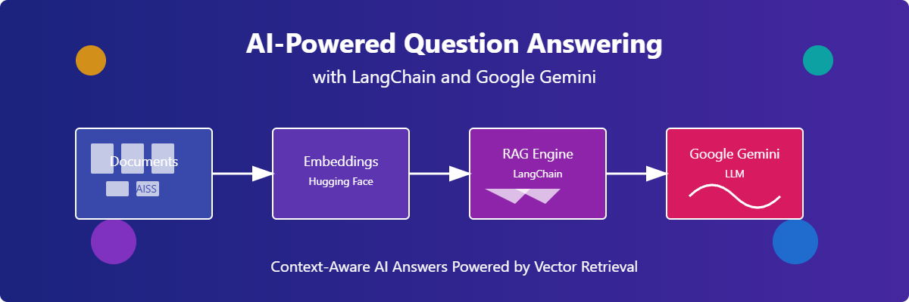

# AI-Powered Question Answering with LangChain and Google Gemini



A Retrieval-Augmented Generation (RAG) pipeline that delivers accurate, context-aware answers by combining document retrieval with Google Gemini's powerful language model.

## 📋 Overview

This project implements an advanced question-answering system using Retrieval-Augmented Generation (RAG) technology. The system leverages:

- **LangChain** framework for building the RAG pipeline
- **Google Gemini** LLM for natural language understanding and response generation
- **Hugging Face Embeddings** for document vectorization
- **FAISS** vector database for efficient similarity search

The system enhances LLM responses by providing relevant context from a document collection, resulting in more accurate, factual answers compared to using an LLM alone.

## ✨ Features

- **Document Processing**: Loads and processes text documents for information retrieval
- **Text Chunking**: Splits documents into manageable chunks for more precise retrieval
- **Semantic Search**: Uses FAISS for fast vector similarity search
- **Context-Aware Responses**: Provides answers based on retrieved document context
- **Source Attribution**: Displays source documents used to generate the answer
- **Customizable Pipeline**: Easy to modify prompt templates and retrieval parameters

## 🚀 Getting Started

### Prerequisites

- Python 3.8+
- Google API key for Gemini access

## 💻 Usage

The project works through the following steps:

1. **Document Collection**: Gather documents you want to query
2. **Vector Store Creation**: Process documents and create embeddings
3. **Query Processing**: Ask questions and receive answers based on document context

## 📊 Example

**Query**: "How can federated learning address data privacy concerns in AI?"

**Answer**:
```
Federated learning helps address data privacy concerns by training AI models locally on devices without transferring 
data to central servers. This means sensitive data remains on individual devices, reducing the risk of breaches or 
misuse.
```

**Sources**:
1. `deploying_ai_models.txt`: Data privacy is another concern. AI models often require access to sensitive data, and ensuring that this data is handled securely is crucial. Techniques such as federated learning, where models are trained locally on devices without transferring data to central servers...
2. `data_privacy.txt`: The future of AI will require a careful balance between innovation and privacy. Companies must prioritize transparency in their data practices and develop AI models that respect user privacy...

## 🔧 Customization

You can customize the system by:

1. **Adjusting Chunk Size**: Modify `chunk_size` and `chunk_overlap` in the text splitter for different granularity
2. **Changing Retrieval Parameters**: Adjust `k` value to retrieve more or fewer documents
3. **Modifying the Prompt Template**: Create a custom prompt for different use cases
4. **Using Different Embedding Models**: Replace the embedding model for different semantic understanding

## 🔮 Future Enhancements

- Web interface for user interactions
- Support for multiple file formats (PDF, DOCX, etc.)
- Question reformulation for improved retrieval
- Multi-document reasoning
- Real-time document indexing
- Hybrid retrieval (combining semantic and keyword search)

## 📄 License

This project is licensed under the MIT License - see the [LICENSE](LICENSE) file for details.
